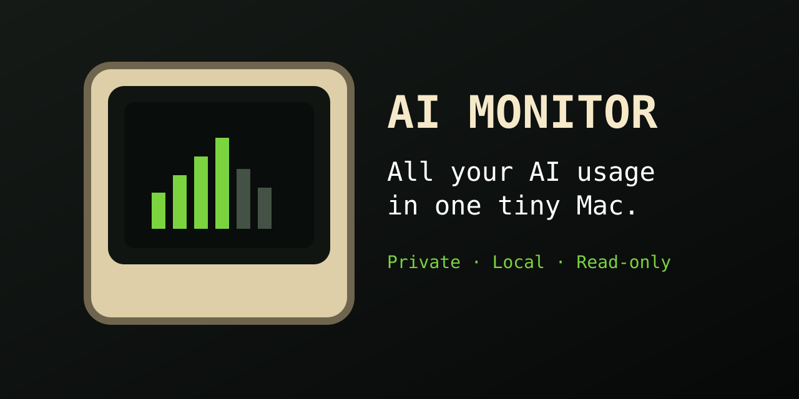

<p align="right"><a href="README.pt-BR.md">Português</a></p>

<p align="center">
  
</p>

# AI Monitor

**All your AI usage in one tiny Mac.**

A lightweight, local-first macOS menu bar app for viewing AI limits, reset times, connection state, and credits when providers officially expose them.

[](.github/workflows/ci.yml)
[](CHANGELOG.md)
[](LICENSE)
[](docs/architecture.md)

> **Current status: source MVP.** The app and widget build locally and the automated unit suite passes. No signed, notarized public DMG has been published from this repository yet, so the release badge deliberately says so.

## Download

[**Download for macOS**](../../releases/latest/download/AI-Monitor.dmg) · [View Releases](../../releases)

The stable download URL becomes active after the first signed and notarized GitHub Release. Until then, developers can [run from source](#build-from-source).

## Why AI Monitor?

AI subscriptions are hard to track across multiple accounts and services. AI Monitor puts the useful pieces in a compact retro popup without requiring you to keep dashboards open.

- Native menu bar utility with no normal Dock icon
- Multiple isolated Codex / OpenAI accounts
- Primary and secondary rate-limit windows
- Remaining percentage and local reset-time formatting
- Small and medium desktop widgets
- Moderate refresh cooldown and exponential failure backoff
- Last-known-good snapshots remain visible during temporary failures
- English and Brazilian Portuguese UI, local JSON storage, Keychain for MCP secrets, and no analytics
- Accessible status text that never depends on color alone

## Supported providers

| Provider | Status | What AI Monitor reads |
|---|---|---|
| Codex / OpenAI | **Available in source MVP** | Official App Server account state and ChatGPT rate limits |
| Kling | **Beta / unavailable** | No balance is shown until a verified official read-only interface exists |
| Custom MCP | **Advanced foundation** | HTTPS/loopback transport, Keychain token wrapper, and exact read-only tool allowlists; connection editor/SSE remain planned |
| Claude, Gemini, Runway, others | **Planned** | Nothing is scraped or invented |

## Installation

When a signed release exists:

1. Download `AI-Monitor.dmg` from the button above.
2. Open the DMG and drag **AI Monitor.app** to **Applications**.
3. Open AI Monitor. It lives in the menu bar, not the Dock.
4. Choose **Add Account → Codex / OpenAI → Sign in with ChatGPT**.
5. Complete the official browser sign-in.

AI Monitor needs the official Codex CLI because the documented Codex App Server supplies account state and rate limits. The app detects common installations and never installs software silently. If Codex is missing, follow the [official Codex CLI guide](https://learn.chatgpt.com/docs/codex/cli).

## How it works

Each Codex account gets its own directory:

```text
~/Library/Application Support/AI Monitor/CodexAccounts/<account UUID>/
```

AI Monitor starts the official `codex app-server` only during sign-in or refresh, communicates over local standard input/output, and sets a separate `CODEX_HOME` for every account. Views never contain JSON-RPC method strings. The widget reads a safe shared snapshot and never starts provider processes or stores credentials.

See [architecture](docs/architecture.md), [Codex integration research](docs/integration-research.md), and [privacy](PRIVACY.md).

## Widgets

After opening AI Monitor at least once:

1. Control-click the macOS desktop and choose **Edit Widgets**.
2. Search for **AI Monitor**.
3. Add the Small or Medium widget.

Widget data is intentionally passive. If it is stale, the widget says **Open AI Monitor to refresh**.

## Privacy

AI Monitor has no analytics or tracking. Account metadata and snapshots stay on this Mac. It never asks for or stores your ChatGPT password. Codex manages its own authentication inside each isolated `CODEX_HOME`; MCP credentials, when that advanced flow is enabled, belong in Keychain. Read [PRIVACY.md](PRIVACY.md) for storage paths and removal steps.

## Build from source

Requirements: macOS 14+, Xcode 16 or newer, and Swift 5-compatible toolchain.

```bash
git clone <repository-url>
cd ai-monitor
./scripts/bootstrap.sh
open AI-Monitor.xcodeproj
```

Or use the scripts directly:

```bash
./scripts/build.sh
./scripts/test.sh
```

Local build and tests do not need a Team ID, provider login, signing certificate, or notarization secret. Real widget sharing and distribution require the manual Apple configuration in [docs/signing.md](docs/signing.md).

## Contributing

Start with [CONTRIBUTING.md](CONTRIBUTING.md) and [creating a provider](docs/creating-a-provider.md). Good first contributions include translations, accessibility checks, previews, documentation, and focused unit tests.

If AI Monitor is useful to you, consider starring the repository. It helps more people discover the project.

## FAQ

<details><summary><strong>Is AI Monitor free?</strong></summary>Yes. The source is MIT licensed. Provider subscriptions remain separate.</details>
<details><summary><strong>Does it send my account data anywhere?</strong></summary>AI Monitor itself has no backend. It talks to provider software or endpoints you explicitly connect to.</details>
<details><summary><strong>Does AI Monitor store my ChatGPT password?</strong></summary>No. The official Codex browser flow handles sign-in and token refresh.</details>
<details><summary><strong>Why does Codex need to be installed?</strong></summary>The official Codex App Server is the documented source for account and rate-limit data. AI Monitor does not scrape ChatGPT.</details>
<details><summary><strong>Can I use multiple Codex accounts?</strong></summary>Yes. Each account receives an isolated `CODEX_HOME`.</details>
<details><summary><strong>Does Kling always expose credit balance?</strong></summary>No. AI Monitor displays “Usage unavailable” instead of guessing.</details>
<details><summary><strong>Why is my widget not updating immediately?</strong></summary>WidgetKit controls scheduling. Open or refresh AI Monitor to write a new snapshot and request a reload.</details>
<details><summary><strong>How do I completely remove AI Monitor?</strong></summary>Quit the app, remove it from Applications, then follow the local-data cleanup steps in <a href="PRIVACY.md">PRIVACY.md</a>.</details>
<details><summary><strong>Why does macOS say the app was downloaded from the internet?</strong></summary>Gatekeeper shows a first-launch notice for downloaded apps. Stable releases must be Developer ID signed and notarized; do not use an unsigned build from an untrusted source.</details>
<details><summary><strong>Where can I report a problem?</strong></summary>Use the connection or bug issue form and remove secrets from diagnostics first.</details>
<details><summary><strong>Can I add another AI provider?</strong></summary>Yes. The provider protocol is extensible; see the contributor guide.</details>

## Roadmap and release

- [Roadmap](ROADMAP.md)
- [Changelog](CHANGELOG.md)
- [Release process](docs/releasing.md)
- [Launch checklist](LAUNCH_CHECKLIST.md)

## License

[MIT](LICENSE) © 2026 AI Monitor contributors.
