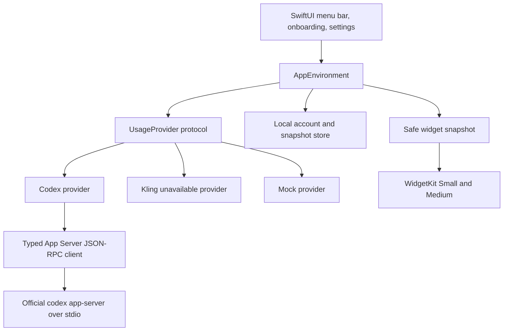

# Architecture

## Deployment target

AI Monitor targets **macOS 14**. `MenuBarExtra` and modern `SMAppService` exist on macOS 13, while the product requirement includes native desktop widgets, making macOS 14 the smallest coherent target.

## Layers

- `Core/Models` supports percentage, credits, measured usage, multiple limits, and optional reset windows without forcing one shape onto every provider.
- `Core/Providers` defines the transport-independent contract.
- `Providers/Codex` owns process discovery, per-account homes, JSON-RPC, login, account state, and rate-limit parsing.
- `Providers/MCP` is isolated and fail-closed: a call needs both an exact per-server allowlist entry and a read-like name, while unsafe names remain blocked.
- `App/AppEnvironment.swift` serializes refreshes, applies cooldown/backoff, and preserves last-known-good snapshots.
- `Shared` contains only safe models compiled into both app and widget.
- Views do not know JSON-RPC method names or credential details.

Each Codex account uses an isolated `CODEX_HOME` with mode `0700`. AI Monitor writes only a mode-`0600` Codex setting that selects Codex's file credential store; the official Codex process creates and refreshes its own authentication file. This tradeoff enables genuinely separate local accounts, but means the isolated directory is sensitive and must never enter diagnostics, source control, or backups shared with others.

Custom MCP bearer tokens are stored in macOS Keychain. Remote endpoints must use HTTPS; plain HTTP is accepted only for `localhost`, `127.0.0.1`, or `::1` development. Tool metadata is untrusted, so discovery never grants automatic execution by itself.

## Signing boundary

Local builds can disable code signing. Production widget sharing requires the same registered App Group entitlement on the app and widget, plus valid Developer ID signing and provisioning. The repository intentionally contains no Team ID, certificate, provisioning profile, or private release configuration.
